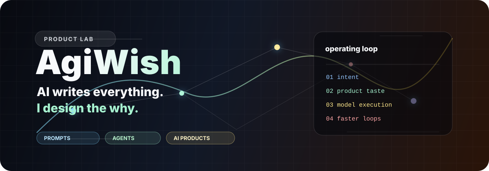

---

**Technical AI Native PM · Builder**

Java 全栈工程师出身，3 年 AI 产品经理。  
不只写 PRD——自己搭 Multi-Agent 架构，自己跑 Graph-RAG 全链路，自己写 ESP32 固件，自己落地 MVP。

> 比纯 PM 更懂技术可行性，比纯工程师更懂产品决策。

**关键交付数字：**

| | |
|---|---|
| 🤖 Multi-Agent 平台 | RL 智能体胜率 **22% → 54%**，日均推演 **3次 → 50次** |
| 📊 Graph-RAG 知识库 | 分析报告生成 **2小时 → 15分钟**，产能提升 **8×** |
| 🔬 Prompt 工程 | F1 值 **68% → 83%**（技术团队和微软专家都说做不到） |
| 👥 用户调研 | **500份**问卷 + **102人**复访驱动知伴 AI MVP 优先级决策 |
| 🛠️ Claude Code Skills | 自研 **20+** 条生产级工作流，覆盖研发/文档/运营 |

---

## Projects

| 项目 | 技术栈 | 一句话 |
|------|--------|--------|
| [**知伴 AI**](https://github.com/AgiWish/zhiban-ai) | Multi-Agent · GPT-4o · DeepSeek-V3 · Node.js · Swift | 亲密关系沟通教练，4条独立子链路 + 长期关系记忆，500份问卷验证 |
| [**MOSS 语音助手**](https://github.com/AgiWish/moss-home-ai) | ESP32-S3 · C++ · LVGL · Home Assistant | 本地 AI，不走云端，NAS 自部署，全屋智能家居控制，响应 <500ms |
| [**MindFlash**](https://github.com/AgiWish/mindflash-mac) | Swift · SwiftUI · Apple Speech · DeepSeek | macOS 菜单栏语音灵感捕捉，双击 ⌘ 唤起，LLM 整理成结构化待办 |
| [**BookBrain**](https://github.com/AgiWish/bookbrain) | Next.js · pgvector · DeepSeek · Chrome Extension | AI 书签管理，语义搜索 + 自动打标，知识图谱可视化 |
| [**Hermes Skills**](https://github.com/AgiWish/hermes-skills-zh) | Claude Code · Markdown · Shell | 20+ 生产级 Claude Code Skills，AI 工作流从「定制」到「复用」 |
| [**AI System Prompts CN**](https://github.com/AgiWish/ai-system-prompts-cn) | Research · Chinese | 主流模型 System Prompt 中文解析，隐藏规则变可读产品材料 |

---

## Stack

**产品** &nbsp;
`Multi-Agent` `Graph-RAG` `RAG 全链路` `Prompt Engineering` `评测体系` `Function Calling` `MCP` `工作流编排`

**开发** &nbsp;
`Java / Spring Boot` `Python` `Node.js` `TypeScript` `Next.js` `Swift / SwiftUI` `C++ / ESP-IDF` `Docker` `pgvector`

**工具** &nbsp;
`Claude Code` `Cursor` `GPT-4o` `DeepSeek` `Figma`

---

## How I Work

- **Agent 优先** — Claude Code + 自建 Skills 工作流处理 80% 重复工作，不 vibe coding，是工程化设计的迭代节奏
- **数据驱动** — 每个产品建评测体系，每个迭代决策有结构化依据
- **本地优先** — 能跑在自己 NAS 上的不走云端（MOSS / BookBrain）
- **快速验证** — 先跑通 MVP，调研数据驱动优先级，再补工程化

---

📬 &nbsp;`zyhcli@gmail.com` &nbsp;·&nbsp; WeChat: `AGI_Wish` &nbsp;·&nbsp; 🌐 [agiwish.com](https://agiwish.com)

