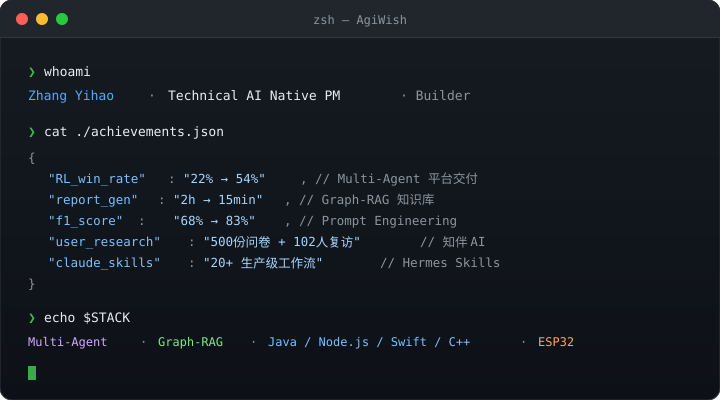

<div align="center">


<br/>



</div>

<br/>

---

### 🗂 Projects

<table>
<tr>
<td width="50%" valign="top">

**[知伴 AI](https://github.com/AgiWish/zhiban-ai)** &nbsp; `iOS · Node.js`

亲密关系 AI 沟通教练。主 Agent 意图识别 → 4 条独立子链路（话术 / 冲突 / 心理 / 倾诉），长期关系记忆模块。GPT-4o 处理截图，DeepSeek-V3 主对话，GPT-4.1 结构化输出。500 份问卷驱动 MVP 优先级。

`Multi-Agent` `GPT-4o` `DeepSeek` `Swift` `Node.js`

</td>
<td width="50%" valign="top">

**[MOSS 语音助手](https://github.com/AgiWish/moss-home-ai)** &nbsp; `ESP32-S3 · C++`

本地 AI，数据不走云端。NAS 自部署后端，MOSS 风格四态 UI（待机 / 监听 / 思考 / 说话），Home Assistant 全屋控制，Music Assistant 多房间播放。响应 <500ms。

`ESP32-S3` `LVGL` `C++` `Home Assistant` `WebSocket`

</td>
</tr>
<tr>
<td width="50%" valign="top">

**[MindFlash](https://github.com/AgiWish/mindflash-mac)** &nbsp; `macOS · Swift`

菜单栏语音灵感捕捉。双击 ⌘ 全局唤起，Apple Speech 本地转写，DeepSeek 整理成结构化灵感 / 待办。SwiftData 本地存储，Keychain 管理 API Key，支持 JSON / Markdown 导出。

`Swift` `SwiftUI` `SwiftData` `Apple Speech` `DeepSeek`

</td>
<td width="50%" valign="top">

**[BookBrain](https://github.com/AgiWish/bookbrain)** &nbsp; `Next.js · pgvector`

AI 书签管理器。pgvector 语义搜索 + DeepSeek 自动打标签摘要，知识图谱可视化关联，Chrome 插件一键收藏，Docker 一键部署。

`Next.js` `pgvector` `DeepSeek` `PostgreSQL` `Chrome Extension`

</td>
</tr>
<tr>
<td width="50%" valign="top">

**[Hermes Skills](https://github.com/AgiWish/hermes-skills-zh)** &nbsp; `Claude Code`

20+ 生产级 Claude Code Skills。覆盖研发 / 文档 / 运营等场景，将 AI 工作流从「逐项目定制」变成「平台化复用」。

`Claude Code` `Prompt Engineering` `Shell` `Workflow`

</td>
<td width="50%" valign="top">

**[AI System Prompts CN](https://github.com/AgiWish/ai-system-prompts-cn)** &nbsp; `Research`

主流大模型 System Prompt 中文解析。隐藏的模型行为规则变成可读的产品材料，帮助 AI PM 理解模型边界。

`LLM Research` `Chinese` `Product Insight`

</td>
</tr>
</table>

---

### 🧰 Stack

```
AI 产品  │  Multi-Agent · Graph-RAG · RAG 全链路 · Prompt Engineering
         │  评测体系设计 · Function Calling · MCP · 工作流编排 · 知识图谱
─────────┼──────────────────────────────────────────────────────────────
开  发   │  Java / Spring Boot · Python · Node.js · TypeScript · Next.js
         │  Swift / SwiftUI · C++ / ESP-IDF · Docker · PostgreSQL / pgvector
─────────┼──────────────────────────────────────────────────────────────
工  具   │  Claude Code · Cursor · GPT-4o · DeepSeek · Figma
```

---

<div align="center">

📬 `zyhcli@gmail.com` &nbsp;·&nbsp; 💬 WeChat `AGI_Wish` &nbsp;·&nbsp; 🌐 [agiwish.com](https://agiwish.com)

</div>
